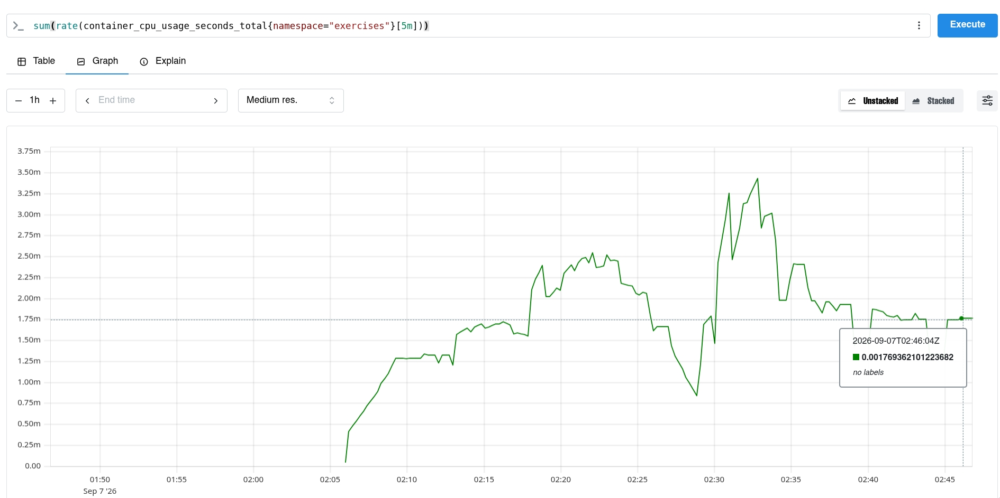

** 4.4. Your canary

Checkout the manifest files:
- [[https://github.com/ukiran03/mooc-k8s/tree/4.4/log-output-ping-pong/manifests/analysis.yaml][AnalysisTemplate (analysis.yaml)]]
- [[https://github.com/ukiran03/mooc-k8s/tree/4.4/log-output-ping-pong/manifests/ping-pong-rollout.yaml][Ping-Pong Rollout (ping-pong-rollout.yaml)]]

*** Verification & Output

#+begin_src bash
$ kubectl get analysisruns -n exercises
NAME                          STATUS       AGE
pingpong-dep-7cdd57fd7c-2-2   Successful   17m
#+end_src

**** Prometheus
Query
#+begin_src
sum(rate(container_cpu_usage_seconds_total{namespace="exercises"}[5m]))
#+end_src

The metric value stays below our =2.0= threshold.

#+ATTR_ORG: :width 250
#+ATTR_HTML: :width 250px

