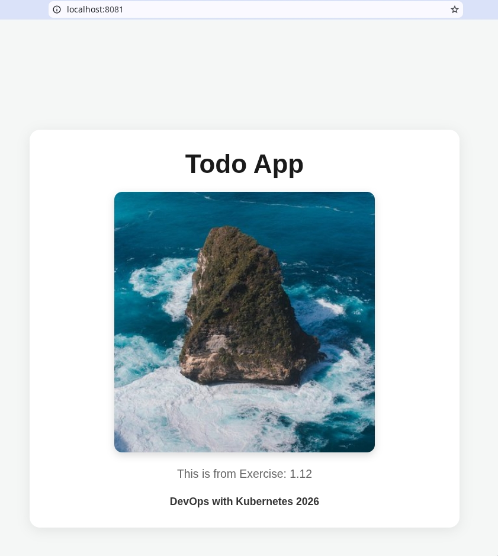

*** 1.12. The project, step 6

#+begin_src bash

# Apply manifests
kubectl apply -f manifests

# Access via load balancer
curl http://localhost:8081/

#+end_src

#+CAPTION: Todo App demo from exercise 1.12
#+NAME:   fig:my-image
#+ATTR_ORG: :width 250
#+ATTR_HTML: :width 250px

