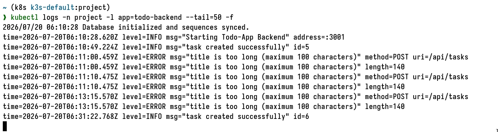

*** 2.10 The project, step 13

#+begin_src bash

## Apply manifests
kubectl apply -f manifests/

# Access via load balancer
curl http://localhost:8081/

#+end_src

#+begin_src
$ cd manifests/monitoring

$ helm upgrade --install prom prometheus-community/prometheus \
  --namespace project \
  --create-namespace \
  --values prom-values.yaml

helm upgrade --install loki grafana/loki \
  --namespace project \
  --values loki-values.yaml

helm upgrade --install k8smon grafana/k8s-monitoring \
  --namespace project \
  --values k8smon-values.yaml

helm upgrade --install grafana grafana/grafana \
  --namespace project \
  --values grafana-values.yaml

$ helm list --namespace project
kubectl get svc --namespace project
kubectl get pods --namespace project

$ kubectl port-forward --namespace project svc/grafana 3000:80

#+end_src

#+CAPTION: Logging from exercise 2.10
#+NAME: fig:demo-images
#+ATTR_HTML: :width 150

**** TODO Unable see logs in Grafana/Loki dashboard, Revisit this.
