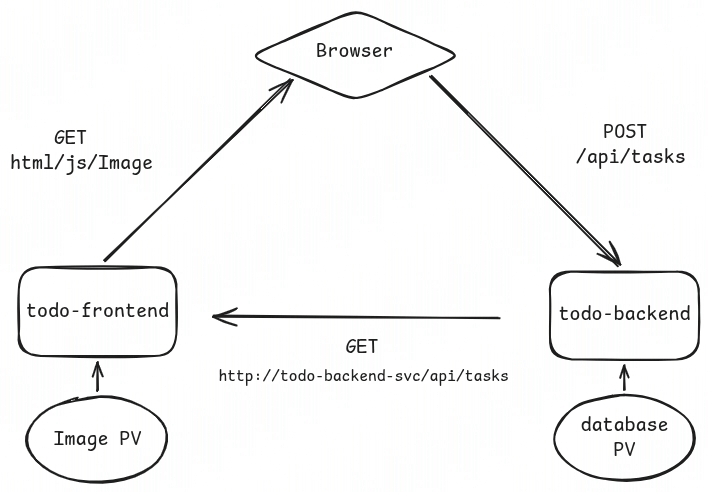
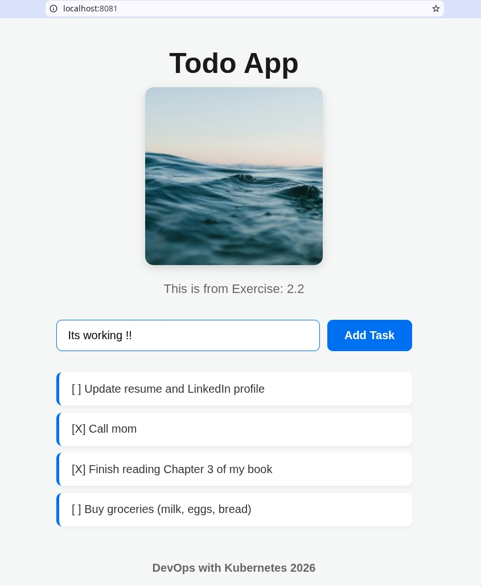
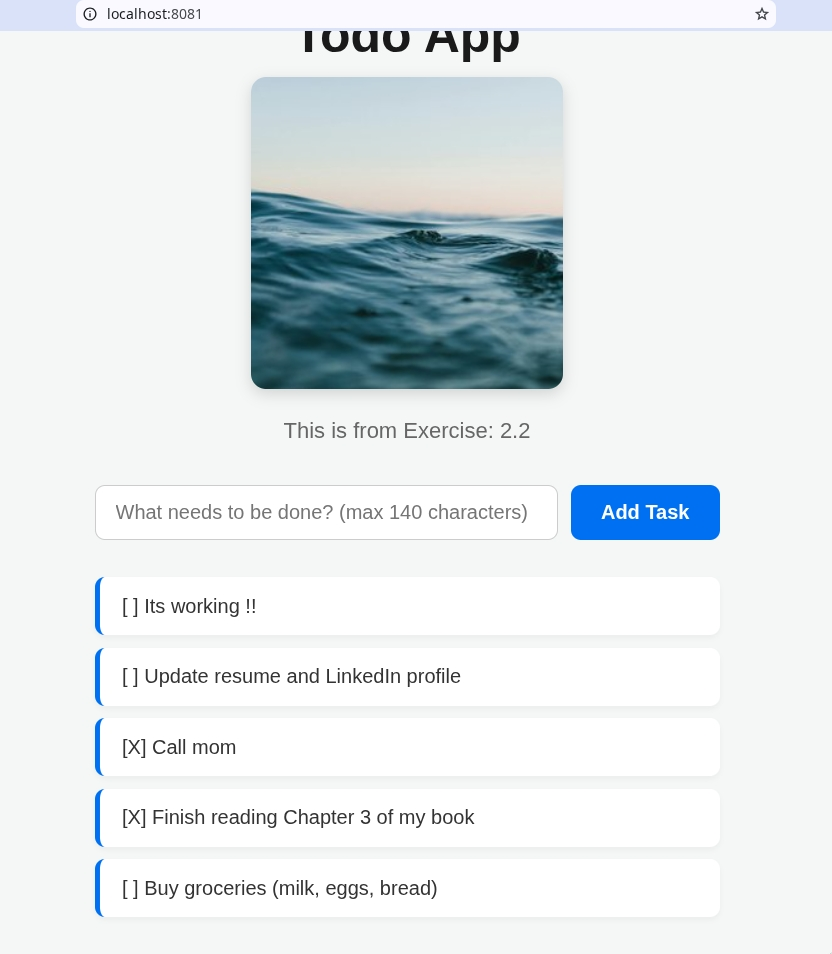

*** 2.2. The project, step 8

#+begin_src bash

# IMPORTANT
docker exec -it k3d-k3s-default-agent-0 mkdir -p /tmp/kube/frontend /tmp/kube/backend

## Apply manifests

# 1. Apply Storage Components first
kubectl apply -f todo-frontend-pv.yaml -f todo-backend-pv.yaml
kubectl apply -f todo-frontend-pvc.yaml -f todo-backend-pvc.yaml

# 2. Apply Network Services next
kubectl apply -f todo-frontend-svc.yaml -f todo-backend-svc.yaml

# 3. Apply Ingress
kubectl apply -f todo-ingress.yaml

# 4. Apply the Applications Deployments
kubectl apply -f todo-frontend-dep.yaml -f todo-backend-dep.yaml

# Access via load balancer
curl http://localhost:8081/

#+end_src

#+CAPTION: Todo App Flow
#+NAME: fig:todo-app-flow
#+ATTR_HTML: :width 100

#+CAPTION: Demo from exercise 2.2
#+NAME: fig:demo-images
#+ATTR_HTML: :width 150

