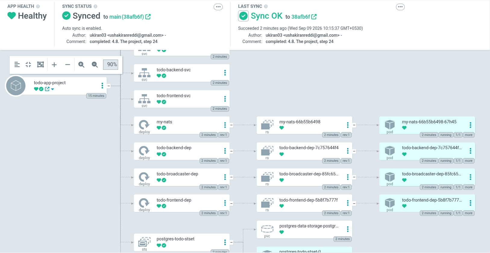

** 4.8

*** Github Workflow
- [[https://github.com/ukiran03/mooc-k8s/tree/4.8/.github/workflows/todo-proj-ci.yaml][Workflow for GitOps (.github/workflows/todo-proj-ci.yaml)]]

*** Running ArgoCD
#+begin_src bash
$ kubectl get pods -n argocd
NAME                                                READY   STATUS    RESTARTS   AGE
argocd-application-controller-0                     1/1     Running   0          26m
argocd-applicationset-controller-79bbd8c9cd-ml4nj   1/1     Running   0          26m
argocd-dex-server-6cdf75744-b6ldw                   1/1     Running   0          26m
argocd-notifications-controller-65878667c-ppfq9     1/1     Running   0          26m
argocd-redis-5f664b9b9c-t8ksd                       1/1     Running   0          26m
argocd-repo-server-7f58d7cdf7-c24mv                 1/1     Running   0          26m
argocd-server-6ccd556fc9-wzvvg                      1/1     Running   0          26m
#+end_src

**** Apply Todo-App's GitOps config
#+begin_src bash
~/prog/mooc-k8s/todo-app on  main (k8s k3s-default:argocd)
$ kubectl apply -f argocd-gitops.yaml -n argocd
application.argoproj.io/todo-app-project created
#+end_src

**** Check the Todo-App namespace

#+begin_src bash

$ kubectl get pods -n project
NAME                                    READY   STATUS    RESTARTS        AGE
my-nats-66b55b6498-67h45                1/1     Running   0               4m1s
postgres-todo-stset-0                   1/1     Running   0               4m1s
todo-backend-dep-7c757644f4-dmzmt       1/1     Running   0               4m1s
todo-broadcaster-dep-85fc65c5c8-4lpgz   1/1     Running   0               4m1s
todo-frontend-dep-5b8f7b777f-nbz7t      1/1     Running   1 (2m57s ago)   4m1s
#+end_src

**** ArgoCD WEB UI

#+ATTR_ORG: :width 250
#+ATTR_HTML: :width 250px

