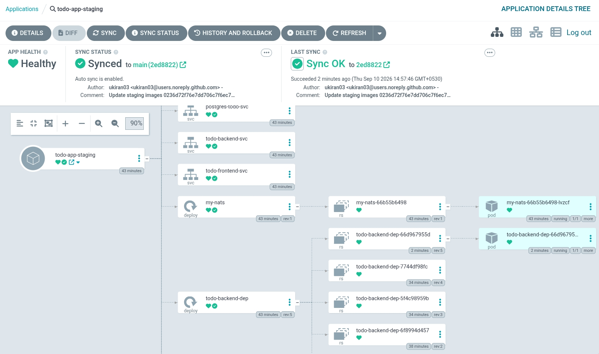
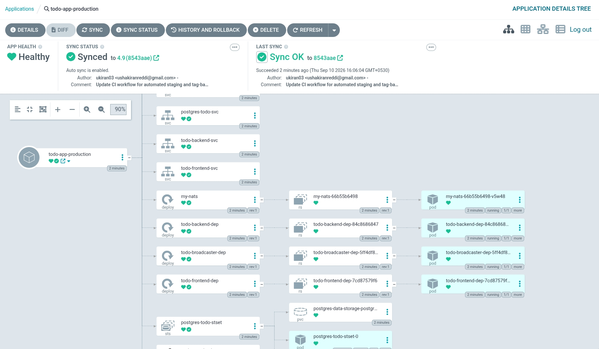

** 4.9. The project, step 25

*** Github Workflow
- [[https://github.com/ukiran03/mooc-k8s/tree/4.9/.github/workflows/todo-proj-ci.yaml][Workflow for GitOps (.github/workflows/todo-proj-ci.yaml)]]

*** ArgoCD WEB UI

**** Staging Environment
#+ATTR_ORG: :width 250
#+ATTR_HTML: :width 250px

**** Production Environment
#+ATTR_ORG: :width 250
#+ATTR_HTML: :width 250px

*** Important Notes and Fixes

1. Kustomize enforces a security restriction preventing a ~kustomization.yaml~
   file from referencing files outside of its own directory tree using ~../~
   paths.
   #+begin_src text
  # ArgoCD Error
  Failed to load target state: failed to generate manifest for source 1 of 1: rpc
  error: code = Unknown desc = `kustomize build <path to cached source>/todo-app/staging`

  failed exit status 1: Error: accumulating resources: accumulation
  err='accumulating resources from '../manifests/app/configmap.yaml': security;
  file '<path to cached source>/todo-app/manifests/app/configmap.yaml' is not in
  or below '<path to cached source>/todo-app/staging'': must build at directory:
  '<path to cached source>/todo-app/manifests/app/configmap.yaml': file is not
  directory
   #+end_src

2. Remove ~namespace.yaml as resource~ from staging & production (because having two
   different Namespace definitions pointing to the name staging)

3. Remove the envFrom block from base/app/broadcaster/deployment.yaml so it
   doesn't try to look up production secrets in staging.
   1. Keep the ~base~ independent and remove ~envFrom~ map, This should be patched
      in the ~Production~ env

4. ArgoCD Tag Pattern Matching :: Does not accept regexp patterns like ~"v4.*"~

5. GitHub Actions Handles Detached Heads On Tag Triggers
