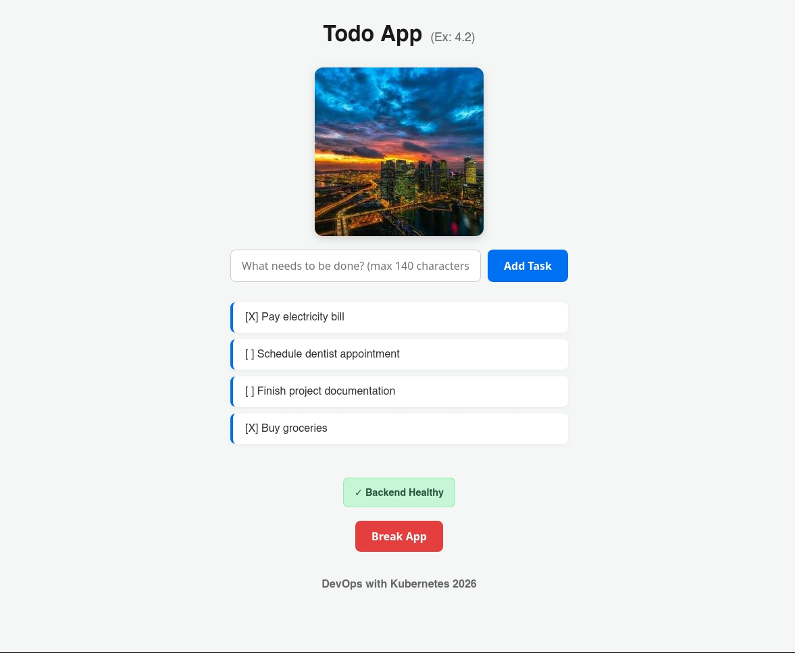
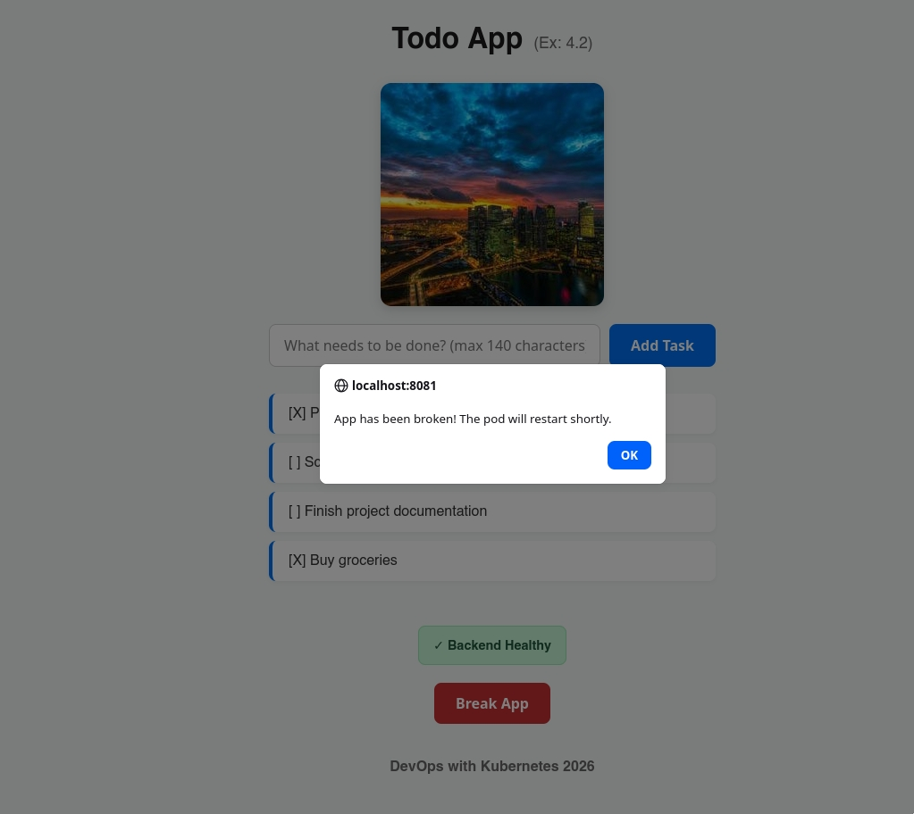
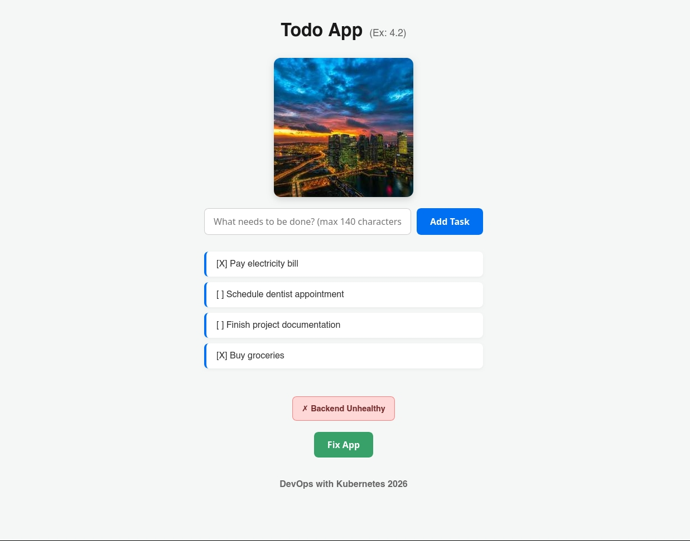

*** 4.2. The project, step 21
#+begin_src bash
$ kubectl get pods -n project
NAME                               READY   STATUS    RESTARTS      AGE
postgres-todo-stset-0              1/1     Running   0             19m
todo-backend-dep-bb785d866-gchz9   1/1     Running   2 (119s ago)  19m
todo-frontend-dep-7564c77d45-s6br7 1/1     Running   0             19m
#+end_src

**** Initial state (healthy)
#+ATTR_ORG: :width 250
#+ATTR_HTML: :width 250px

**** Clicking the break button (unhealthy state)
#+ATTR_ORG: :width 250
#+ATTR_HTML: :width 250px

**** Starting a new backend pod 🔄
#+ATTR_ORG: :width 250
#+ATTR_HTML: :width 250px

