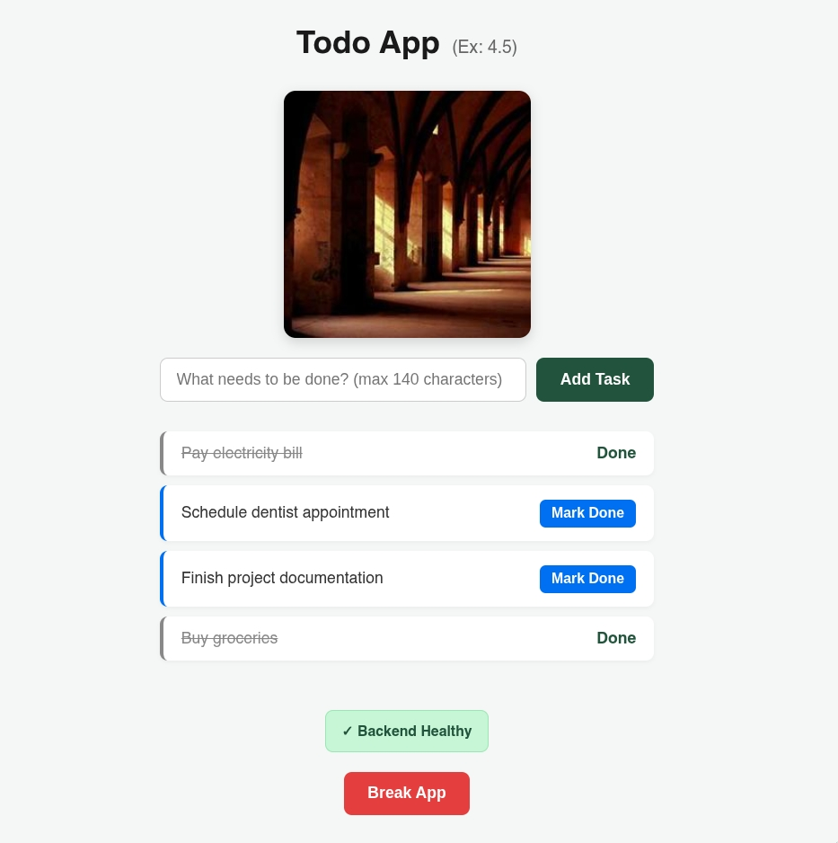
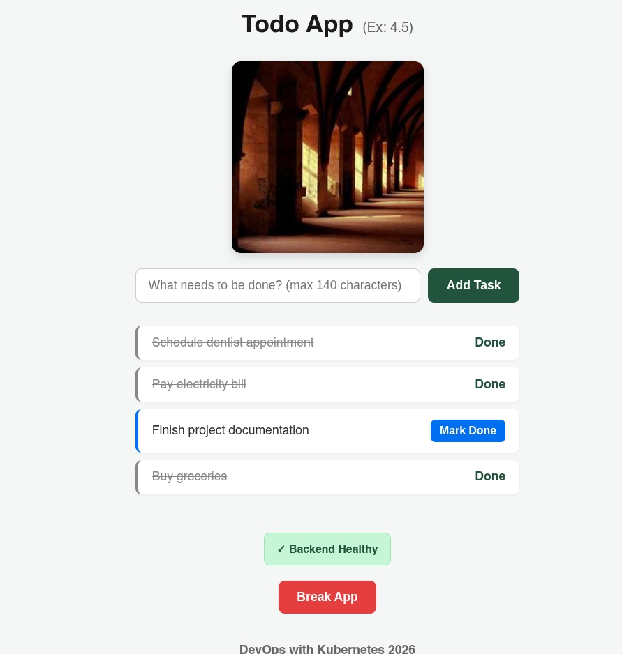

*** 4.5. The project, step 22

#+begin_src
$ kubectl get pods -n project
NAME                                READY   STATUS    RESTARTS       AGE
postgres-todo-stset-0               1/1     Running   0              2m47s
todo-backend-dep-565994bbd4-ts9x6   1/1     Running   0              2m47s
todo-frontend-dep-9dbbd6895-8mlnh   1/1     Running   1 (2m4s ago)   2m47s
#+end_src

#+begin_src bash
xdg-open http://localhost:8081
#+end_src

#+ATTR_ORG: :width 250
#+ATTR_HTML: :width 250px

#+ATTR_ORG: :width 250
#+ATTR_HTML: :width 250px

