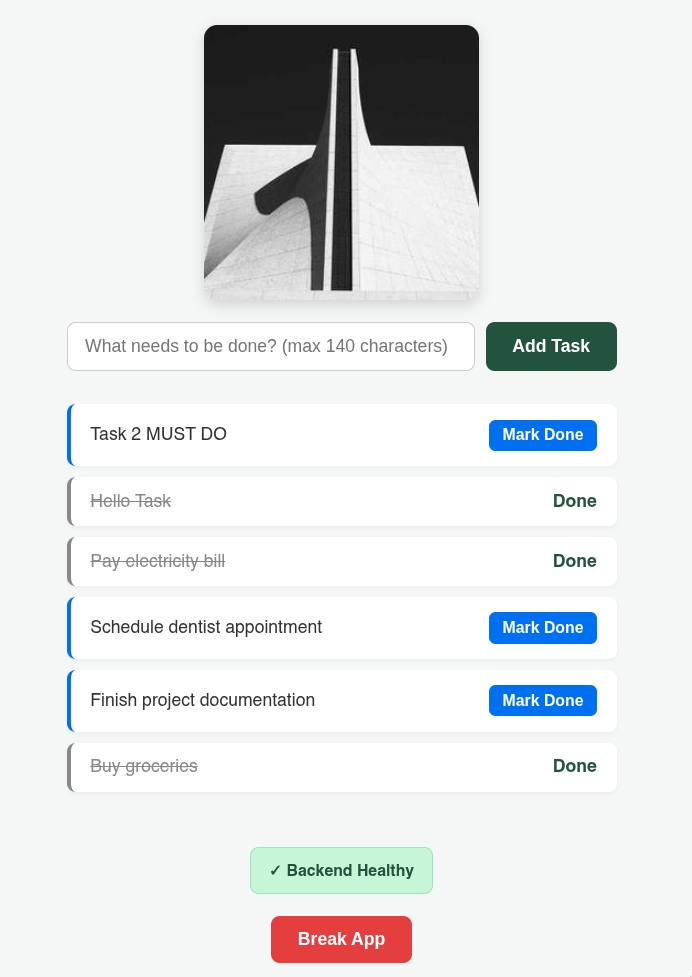
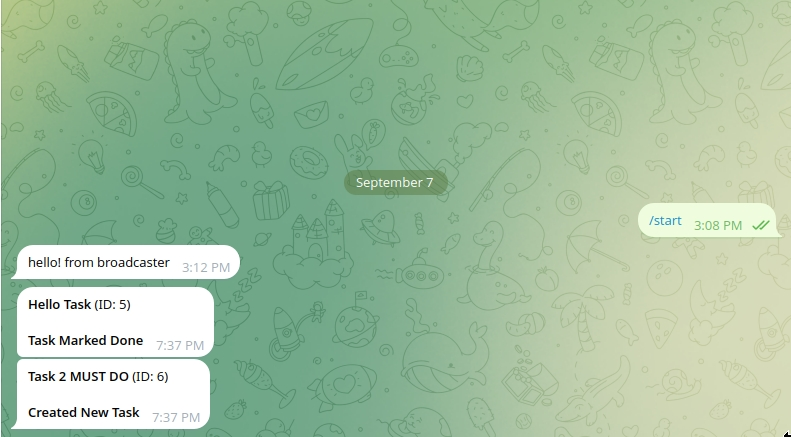

*** 4.6. The project, step 23

Verify that all project pods are running successfully in the cluster:

#+begin_src
$ kubectl get pods -n project
NAME                                    READY   STATUS    RESTARTS   AGE
my-nats-66b55b6498-frznv                1/1     Running   0          10m
postgres-todo-stset-0                   1/1     Running   0          10m
todo-backend-dep-7f4869599b-zlpbg       1/1     Running   0          2m16s
todo-broadcaster-dep-777c4bbcbd-nr65k   1/1     Running   0          6m21s
todo-frontend-dep-5b8f7b777f-99bj4      1/1     Running   0          10m
#+end_src

Open the application interface in your browser:

#+begin_src bash
xdg-open http://localhost:8081
#+end_src

**** Browser Interface
#+ATTR_ORG: :width 250
#+ATTR_HTML: :width 250px

**** Telegram Notification
#+ATTR_ORG: :width 250
#+ATTR_HTML: :width 250px

